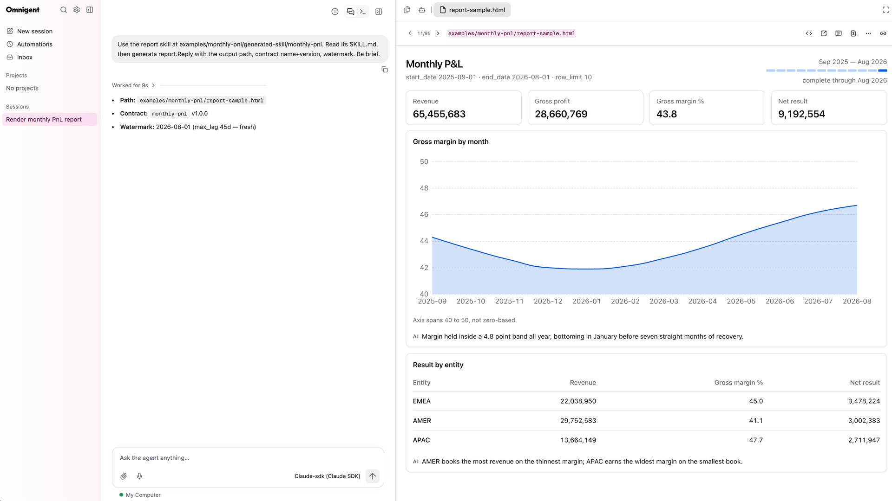

# Databricks Skill To App

[](https://github.com/Paldom/databricks-skill-to-app/actions/workflows/ci.yml)
[](LICENSE)
[](https://skills.sh/Paldom/databricks-skill-to-app)

From a coding-agent skill to a Databricks App, with one governed reporting core.



Build a report skill with `report-skill-builder` → run it to render the report → iterate →
ship the same queries as a Databricks App with `report-to-databricks-app`.

Agent Skills for [Claude Code](https://code.claude.com/docs/en/skills) (and any
[Agent Skills](https://agentskills.io)-compatible tool). Each skill is a folder under
[`skills/`](skills/) with a single-purpose `SKILL.md`, trigger evals, and optional
scripts/references — validated on every write, commit, and PR.

## Quick start

Install with the [skills CLI](https://skills.sh) — auto-detects 70+ agents
(Claude Code, Codex, Cursor, Copilot, pi, …):

```bash
npx skills add Paldom/databricks-skill-to-app                  # all detected agents
npx skills add Paldom/databricks-skill-to-app -a codex -a pi   # or target specific agents
```

Or with the [GitHub CLI](https://cli.github.com/manual/gh_skill_install) (≥ 2.90),
including version-pinned installs from releases:

```bash
gh skill install Paldom/databricks-skill-to-app
gh skill install Paldom/databricks-skill-to-app <skill> --pin <tag>
```

Or as a Claude Code plugin:

```
/plugin marketplace add Paldom/databricks-skill-to-app
/plugin install databricks-skill-to-app@databricks-skill-to-app
```

Or copy a single skill into a project:

```bash
git clone https://github.com/Paldom/databricks-skill-to-app.git
cp -r databricks-skill-to-app/skills/<skill-name> your-project/.claude/skills/
```

Then just describe the task — the skill activates on its description — or invoke it
explicitly with `/<skill-name>`.

## Skills

| Skill | Description |
| --- | --- |
| [`governed-report-contract`](skills/governed-report-contract/) | Defines and validates the versioned contract — `report.yaml` plus parametric trusted queries and metric-view bindings — that every consumer of a report reads instead of writing its own SQL. |
| [`report-skill-builder`](skills/report-skill-builder/) | Generates a self-contained report skill from a contract: a Statement Execution runner, a shadcn + ECharts HTML report, and its own evals. |
| [`report-to-databricks-app`](skills/report-to-databricks-app/) | Materializes the same contract into a Databricks AppKit app — queries copied byte-for-byte, metric views bound, drift gated by a hash manifest. |

They compose into one workflow: **contract → skill → app**. The paste-ready
[`docs/setup-prompt.md`](docs/setup-prompt.md) runs it end to end.

## Repository structure

```
skills/                  # distributed skills, one folder per skill (SKILL.md + evals/ + scripts/)
examples/monthly-pnl/    # worked example: semantic layer + contract + report skill + app + DAB
docs/                    # skill-authoring guide, eval methodology, setup prompt, deployment guide
scripts/                 # deterministic validator used by hooks and CI
skills.sh.json           # skills.sh repo-page customization (groupings)
.claude/                 # agentic dev setup: hooks + bundled add-skill / publish-repo skills
.claude-plugin/          # plugin + marketplace manifests (makes this repo installable)
.local/                  # gitignored working area: sources, research, PROMPT.md (see below)
```

## Working on this repo with an agent

This repo is agent-native: canonical agent instructions live in
[AGENTS.md](AGENTS.md) (CLAUDE.md imports it), hooks validate every `SKILL.md` on
write, `make check` runs the full validator, and CI enforces the same gate on every
PR. The bundled `add-skill` skill walks the eval-first authoring workflow described
in [docs/skill-authoring.md](docs/skill-authoring.md). Maintainers drive sessions
with their own (gitignored, personal) `.local/PROMPT.md` goal prompt.

## Contributing

Contributions welcome — see [CONTRIBUTING.md](CONTRIBUTING.md) for the skill-proposal
process, the authoring workflow, and the PR checklist. Please note the
[Code of Conduct](CODE_OF_CONDUCT.md).

## Support

Questions, ideas, or something not working? Start with [SUPPORT.md](SUPPORT.md) —
bugs and skill proposals have [issue templates](../../issues/new/choose), and
security concerns go through [SECURITY.md](SECURITY.md) (never a public issue).

## License

[MIT](LICENSE) © 2026 Paldom
